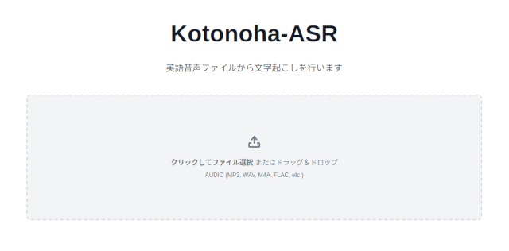
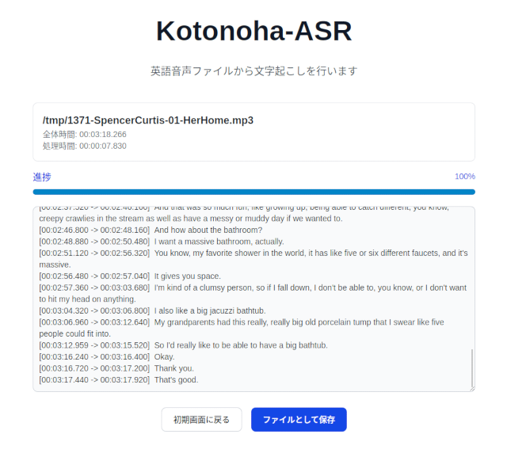

# Kotonoha-ASR

Kotonoha-ASR is a desktop application that transcribes audio files into text with timestamps using an Automatic Speech Recognition (ASR) model. Simply drag and drop an audio file or select it via a file dialog to start the analysis. The transcription results can be saved to a text file.

On the first launch, the application downloads the necessary ASR models, which may take some time.




## ✨ Features

- **Audio Transcription**: Converts speech from audio files into written text.
- **Simple Interface**: Start transcription by dragging and dropping a file or selecting it from a dialog.
- **Save Results**: Export the transcription, including timestamps, to a file.

## 📥 Installation

**Download the Installer**: Visit the [Releases](https://github.com/k5n/kotonoha-asr/releases) page to download the latest installer for your operating system.

## 🚀 How to Use

1.  **Launch the application.**
2.  **Initial Model Download**: On your first use, the app will automatically download the ASR models. Please wait for this process to complete.
3.  **Select an Audio File**: Drag and drop an audio file onto the application window, or click the selection button to open a file dialog.
4.  **Transcription**: The analysis will begin automatically. You can monitor the progress on the screen.
5.  **Save Transcription**: Once the transcription is complete, you can save the results to a local file.

---

## 📄 License

The application source code is licensed under the **GPLv3**. See the [LICENSE](./LICENSE) file for details.

Configuration and development environment files (such as linter configs, TypeScript configs, build scripts, `tools`, etc.) are licensed under the **MIT License** unless otherwise noted. See the [MIT LICENSE](./LICENSE-MIT) file for details.

---

## 🛠️ For Developers

This section provides instructions for developers who want to contribute to or build the application from the source.

### Technology Stack

- **Framework**: [Tauri](https://tauri.app/)
- **Frontend**: [Svelte 5 with SvelteKit](https://svelte.dev/) and [TypeScript](https://www.typescriptlang.org/)
- **UI Library**: [Flowbite Svelte](https://flowbite-svelte.com/) with [Tailwind CSS](https://tailwindcss.com/)
- **Backend**: [Rust](https://www.rust-lang.org/)

### Project Structure

The project follows a layered architecture on the frontend to separate concerns:

```
/
├── src/              # SvelteKit Frontend
│   ├── lib/
│   │   ├── presentation/ # UI Layer (Svelte components)
│   │   ├── application/  # Application Layer (Use cases, State management)
│   │   ├── domain/       # Domain Layer (Core business logic, Entities)
│   │   └── infrastructure/ # Infrastructure Layer (External communication)
│   └── routes/         # SvelteKit routing
├── src-tauri/        # Rust Backend
└── ...
```

For more details, please refer to the [Technical Specifications](./doc/technical_specifications.md).

### Prerequisites

<!-- cSpell:ignore libclang devel -->

- [Node.js](https://nodejs.org/) and npm
- [Rust](https://www.rust-lang.org/tools/install) and Cargo
- Follow the Tauri setup guide for your OS: [Tauri Prerequisites](https://tauri.app/start/prerequisites/)
- Clang
  - **Windows**: Download and install [LLVM](https://github.com/llvm/llvm-project/releases).
  - **Linux**: You need the shared libraries provided by `libclang`. Install the development package via your distribution's package manager (e.g., `sudo apt install libclang-dev`, `sudo dnf install clang-devel`, etc.).
  - **macOS**: If you have completed the Tauri setup, the required `libclang` libraries should already be available. No additional installation is required.

### Development Setup

1.  **Clone the repository:**

    ```bash
    git clone https://github.com/k5n/kotonoha-asr.git
    cd kotonoha-asr
    ```

2.  **Install Node.js dependencies:**

    ```bash
    npm install
    ```

3.  **Run the application in development mode:**
    ```bash
    npm run dev
    ```

### Available Scripts

- `npm run dev`: Starts the development server with hot-reloading.
- `npm run build`: Builds the application for production.
- `npm run check`: Runs Svelte check for type-checking.
- `npm run test`: Executes tests with Vitest.
- `npm run lint`: Lints the codebase with ESLint.
- `npm run format`: Formats the code with Prettier.
- `npm run generate:graph`: Generates a dependency graph diagram and saves it to [`doc/dependency-graph.md`](./doc/dependency-graph.md).

### Building AppImage Locally on Linux (for Developers)

If you are developing on Linux, you can build the AppImage package locally using Docker and Docker Compose. This provides a reproducible environment similar to the official GitHub Actions workflow.

#### Prerequisites

- [Docker](https://docs.docker.com/get-docker/)
- [Docker Compose](https://docs.docker.com/compose/install/)

#### Steps

1. **Set your user ID and group ID**

   To ensure build artifacts are owned by your user, create a `.env` file in the project root with your UID and GID:

   ```sh
   echo "UID=$(id -u)" > .env
   echo "GID=$(id -g)" >> .env
   ```

2. **Build and run the container**

   ```sh
   docker-compose up
   ```

   This will install all dependencies, build the project, and generate the AppImage file in `src-tauri/target/release/bundle/appimage`.

3. **Check the build output**

   The build progress will be shown in your terminal. After completion, you can find the generated `.AppImage` file in the above directory.

#### Notes

- This workflow is intended for **local development only**. Official release builds are performed by GitHub Actions.
- The container uses your UID/GID to avoid permission issues with build artifacts.
- If you encounter permission errors related to Rust or Node.js, ensure your UID/GID are set correctly in `.env`.

If you build the AppImage without using the provided Docker environment (Ubuntu 22.04), you may encounter issues related to WebKitGTK version compatibility (such as problems with WebKitGTK 2.48).

References:

- [Tauri GitHub issue #9662](https://github.com/tauri-apps/tauri/issues/9662)
- [Tauri GitHub issue #13183](https://github.com/tauri-apps/tauri/issues/13183)
- [Tauri GitHub issue #13204](https://github.com/tauri-apps/tauri/issues/13204)
- [Tauri GitHub issue #13899](https://github.com/tauri-apps/tauri/issues/13899)
- [Tauri GitHub issue #13885](https://github.com/tauri-apps/tauri/issues/13885)
