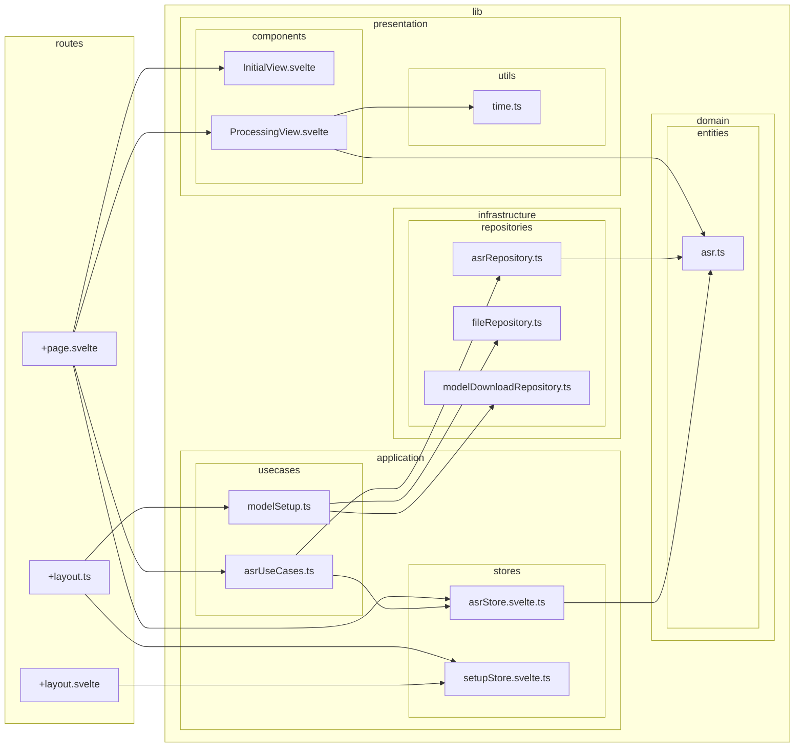

# Src Dependency Graph

`src/` 以下の各ファイルの import 依存関係を解析した結果グラフ。

```mermaid
graph LR
        subgraph "lib"
            subgraph "application"
                subgraph "stores"
                    src_lib_application_stores_asrStore_svelte_ts["asrStore.svelte.ts"]
                    src_lib_application_stores_setupStore_svelte_ts["setupStore.svelte.ts"]
                end
                subgraph "usecases"
                    src_lib_application_usecases_asrUseCases_ts["asrUseCases.ts"]
                    src_lib_application_usecases_modelSetup_ts["modelSetup.ts"]
                end
            end
            subgraph "domain"
                subgraph "entities"
                    src_lib_domain_entities_asr_ts["asr.ts"]
                end
            end
            subgraph "infrastructure"
                subgraph "repositories"
                    src_lib_infrastructure_repositories_asrRepository_ts["asrRepository.ts"]
                    src_lib_infrastructure_repositories_fileRepository_ts["fileRepository.ts"]
                    src_lib_infrastructure_repositories_modelDownloadRepository_ts["modelDownloadRepository.ts"]
                end
            end
            subgraph "presentation"
                subgraph "components"
                    src_lib_presentation_components_InitialView_svelte["InitialView.svelte"]
                    src_lib_presentation_components_ProcessingView_svelte["ProcessingView.svelte"]
                end
                subgraph "utils"
                    src_lib_presentation_utils_time_ts["time.ts"]
                end
            end
        end
        subgraph "routes"
            src_routes__layout_svelte["+layout.svelte"]
            src_routes__layout_ts["+layout.ts"]
            src_routes__page_svelte["+page.svelte"]
        end
src_lib_application_stores_asrStore_svelte_ts --> src_lib_domain_entities_asr_ts
src_lib_application_usecases_asrUseCases_ts --> src_lib_application_stores_asrStore_svelte_ts
src_lib_application_usecases_asrUseCases_ts --> src_lib_infrastructure_repositories_asrRepository_ts
src_lib_application_usecases_modelSetup_ts --> src_lib_infrastructure_repositories_fileRepository_ts
src_lib_application_usecases_modelSetup_ts --> src_lib_infrastructure_repositories_modelDownloadRepository_ts
src_lib_infrastructure_repositories_asrRepository_ts --> src_lib_domain_entities_asr_ts
src_lib_presentation_components_ProcessingView_svelte --> src_lib_domain_entities_asr_ts
src_lib_presentation_components_ProcessingView_svelte --> src_lib_presentation_utils_time_ts
src_routes__layout_svelte --> src_lib_application_stores_setupStore_svelte_ts
src_routes__layout_ts --> src_lib_application_stores_setupStore_svelte_ts
src_routes__layout_ts --> src_lib_application_usecases_modelSetup_ts
src_routes__page_svelte --> src_lib_application_stores_asrStore_svelte_ts
src_routes__page_svelte --> src_lib_application_usecases_asrUseCases_ts
src_routes__page_svelte --> src_lib_presentation_components_InitialView_svelte
src_routes__page_svelte --> src_lib_presentation_components_ProcessingView_svelte
```
