# Kotonoha-ASR 技術仕様書

## 1. 概要 (Overview)

### 1.1. システムアーキテクチャ

- **フレームワーク**: Tauri 2.x
  - **バックエンド**: Rust
  - **フロントエンド**: Svelte 5 (SvelteKit, TypeScript)
- **UIライブラリ**: Flowbite Svelte (+ Tailwind CSS)
- **データベース**: SQLite
  - [Tauri SQL Plugin](https://tauri.app/plugin/sql/) を利用。DBとの通信はフロントエンドの`Infrastructure`レイヤーに集約する。

### 1.2. ディレクトリ構成

Tauriの標準構成とフロントエンドのレイヤードアーキテクチャを組み合わせる。

```plaintext
/
├── src/                              # SvelteKit フロントエンド
│   ├── lib/
│   │   ├── presentation/             # UI層: SvelteコンポーネントとUIロジック
│   │   │   ├── components/           # 再利用可能なUIコンポーネント
│   │   │   └── utils/                # UIで利用するユーティリティ関数
│   │   ├── application/              # アプリケーション層: ユースケースと状態管理
│   │   │   ├── locales/              # 多言語対応
│   │   │   │   ├── en.ts
│   │   │   │   ├── ja.ts
│   │   │   │   └── ...
│   │   │   ├── usecases/             # ユーザー操作を起点とする処理フロー
│   │   │   └── stores/               # アプリケーション全体の状態(Svelte Stores)
│   │   ├── domain/                   # ドメイン層: アプリケーションの核となるルールとデータ構造
│   │   │   ├── entities/             # アプリケーションの核となるデータ型(エンティティ)
│   │   │   └── services/             # ドメイン固有のロジック（単体テストが容易な純粋関数）
│   │   └── infrastructure/           # インフラ層: 外部システムとの連携
│   │       └── repositories/         # DBやRustバックエンドとの通信処理
│   ├── routes/                       # SvelteKitのルーティング (Presentation層の一部)
│   └── app.html
├── src-tauri/                        # Rust バックエンド
│   ├── src/
│   │   ├── main.rs                   # エントリーポイント
│   │   ├── lib.rs                    # ライブラリとしてのエントリーポイント
│   │   └── ...
│   └── tauri.conf.json
└── ...
```

#### フロントエンドの各階層の依存関係

```mermaid
graph TD
    classDef cssTypes fill:#352;
    classDef cssComponents fill:#325;
    classDef cssPure fill:#535;
    classDef cssExternal fill:#333;

    User([User]):::cssExternal

    subgraph Presentation
        components[components]:::cssComponents
        routes[routes]:::cssComponents
    end

    subgraph Application
        usecases[usecases]
        stores[stores]
    end

    subgraph Domain
        entities[entities]:::cssTypes
        services[services]:::cssPure
    end

    subgraph Infrastructure
        repositories[repositories]:::cssPure
    end

    ExternalSystems([External Systems]):::cssExternal

    User ---> components
    routes --> components
    routes ---> usecases
    routes ---> stores
    usecases --> entities
    usecases --> stores
    usecases ---> services
    usecases ---> repositories
    stores ---> entities
    services ---> entities
    repositories ---> entities
    repositories ---> ExternalSystems

    Components:::cssComponents
    PureTypeScript[Pure TypeScript Code]:::cssPure
    TypeDefinitions[Type Definitions]:::cssTypes
```



---

## 3. フロントエンド レイヤー別責務とAPI設計

### 3.1. フロントエンド レイヤー別責務

- **Presentation (`src/routes`, `src/lib/presentation/`)**: Svelteコンポーネントで構成。ユーザーからの入力を受け取り、`Application`層のユースケースを呼び出す。ユースケースから返された結果や`stores`の状態を画面に描画することに専念する。
- **Application (`src/lib/application/`)**: ユースケースを実装する層。ユースケースは、`Domain`のデータ構造やサービスを使い、`Infrastructure`のリポジトリを呼び出して永続化を行う、といった一連の処理フローを定義する。`stores`を用いてUIにまたがる状態を管理する。
- **Domain (`src/lib/domain/`)**: アプリケーションのビジネスロジックの核。外部のライブラリやフレームワークに依存しない、純粋なTypeScriptで記述される。
  - **`entities/`**: アプリケーションの核となるデータ型、エンティティの型定義。
  - **`services/`**: ドメイン固有のルールや計算を行うロジック。
- **Infrastructure (`src/lib/infrastructure/`)**: 外部システムとの通信を担当する層。
  - **`repositories/`**: Tauri SQL Pluginを介したDB操作や、RustバックエンドのTauriコマンドを呼び出す処理を実装する。`Application`層はここのインターフェースを通じて外部と通信する。

### 3.2. バックエンド API (Tauri Commands)

Rustで実装し、フロントエンドの`Infrastructure`レイヤーから呼び出される関数群。
Tauriのプラグインを利用するなどしてフロントエンド側で実装可能と判断したものは、必ずしも Rust 側で実装しなくても良い。
